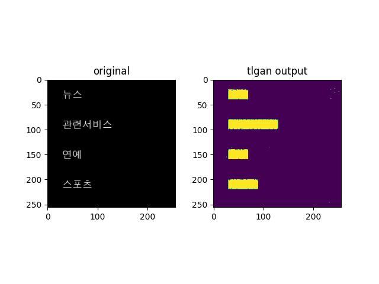
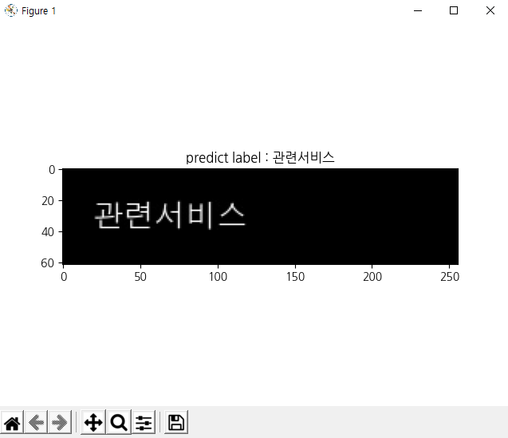

# BrailleOCR

점역이 필요한 문서를 인식하는 한글OCR 시스템(프로토타입)  
글자의 위치를 추정하는 모델과 글자 분류모델을 나누어 학습하여  
한글문서 이미지를 입력으로 받아 점자로 번역한다  
한글을 점자로 변환하는 알고리즘은 https://github.com/SYR-Aegis/braille_printer/blob/master/braille/software_braille.py 을 참조  

### Requirements

| library       | version  |
| :------------ | :------- |
| pytorch       | 1.7.0    |
| opencv-python | 4.4.0.44 |
| numpy         | 1.18.5   |
| bs4           | 4.9.3    |
| requests      | 2.25.1   |

### Inference

    python inference.py 

|       인자명       |              용도               |          기본값           |
| :----------------: | :-----------------------------: | :-----------------------: |
| --tlgan_model_path |   tlgan 모델 파일 까지의 경로   |  ./weights/generator.pt   |
| --crnn_model_path  |   crnn 모델 파일 까지의 경로    |    ./weights/crnn.pth     |
|   --path_to_img    | 추론에 사용할 이미지파일의 경로 | ./data/images/TLGAN/0.jpg |
|    --visualize     |      추론시 가시화의 여부       |           True            |

## TLGAN

Original paper  
https://arxiv.org/abs/2010.11547  
이미지 내에서 한글이 존재하는 영역을 예측하는 text localization은 TLGAN을 이용해 해결한다  
TLGAN은 주어진 이미지에 대해 텍스트가 존재하는 영역을 Gaussian cylindrical map으로 나타낸 이미지를 반환한다  

### TLGAN 학습
    python tlgan_train.py

|인자명|용도|기본값|
|-----|---|----|
|--model_path|TLGAN모델이 저장돼있는 경로|./weights/|
|--data_path|학습에 필요한 데이터까지의 경료|./data/|
|--epoch|전체 학습 횟수|1000|
|--load_model|저장된 모델을 불러올지에 대한 여부|True|
|--batch_size|학습에 사용될 배치 크기|8|

## CRNN

Original paper  

https://arxiv.org/abs/1507.05717  

이미지 내의 한글을 인식하는 text recognition은 crnn모델을 이용한다  

### CRNN 학습

    python crnn_train.py

|    인자명    |           용도            |       기본값       |
| :----------: | :-----------------------: | :----------------: |
| --load_model |   crnn 모델파일의 경로    | ./weights/ |
| --save_model | crnn 모델 파일까지의 경로 | ./weights/ |
| --batchSize  |      학습 배치 크기       |         32         |
|   --n_iter   |       전체 epoch 수       |        500         |

## Contacts

이종민 (myeddie77@gmail.com)  anything about this project

신정우 (sjo506@naver.com)  for tlgan

정의령 (wjddmflud@gmail.com)  for crnn

김경민 (keung903@naver.com) for crawling